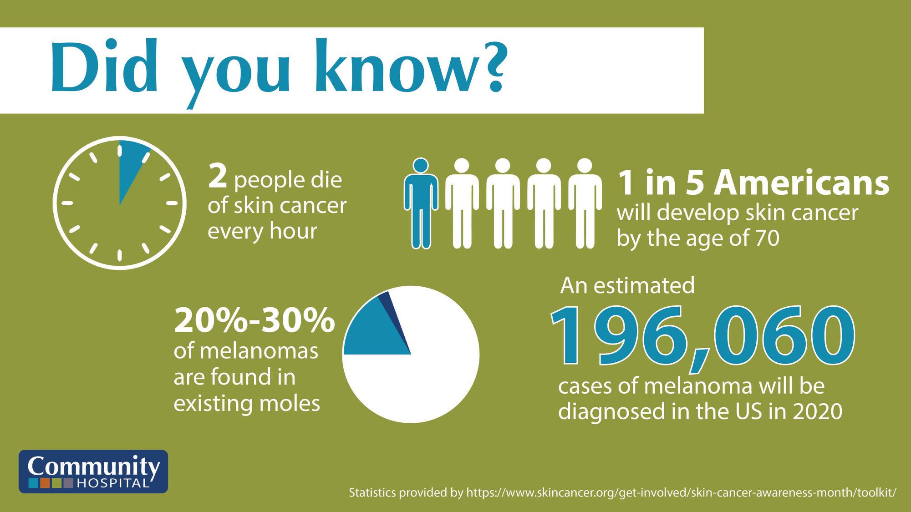
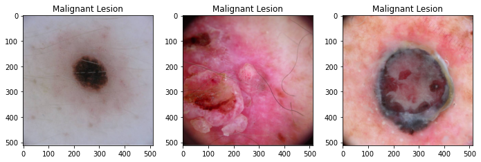
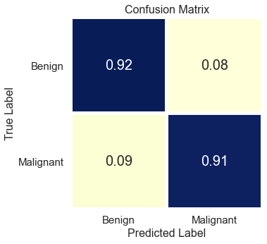

# Skin Cancer Image Classification


## Project Overview
According to [American Academy of Dermatology](https://www.aad.org/media/stats-skin-cancer), skin cancer is the most commonly diagnosed cancer in the United States. Almost 9,500 people in US are diagnosed with skin cancer everyday, and it is estimated that 20% of the Americans will develop skin cancer in their lifetime. The vast majority of the skin cancer deaths are from melanoma.  However, if the melanoma is detected and treated early, before it spreads to lymph nodes, 5-years survival rate is as high as 99%. This indicates the importance of early diagnosis of melanoma for skin cancer patients.

On the other hand, the number of unnecessary biopsies for melanoma detection varies between 83% to 96% according to [Assessment of Raman Spectroscopy for Reducing Unnecessary Biopsies for Melanoma Screening](https://www.ncbi.nlm.nih.gov/pmc/articles/PMC7355922/) article. These unnecessary biopsies challenges both patients and healthcare system financially. It is important to improve the accuracy of melanoma diagnosis to reduce this financial burden. 

The aim of this project is to use Convolutional Neural Network (CNN) to distinguish dermoscopic images of malignant skin lesions from benign lesions. 

## Data Overview

In this project **12,436** dermoscopic images are gathered from from [ISIC archive](https://www.isic-archive.com/#!/topWithHeader/onlyHeaderTop/gallery?filter=%5B%5D). From the final dataset, 8953 images with 4845 benign and 4108 malignant classes are used for training purpose, 2239 images with 1211 benign and 1028 malignant classes are used for validation, and 1244 images are set aside as a test/holdout set for final evaluation which icludes 694 benign and 550 malignant images. Each dataset contains dermoscopic images of unique benign and malignant skin lesions along with metadata info of patient's age, sex, and anatomic location of the lesion.




Since all the neural network models in this project are run on a local computer, in order to reduce preprocessing time the 512x512 resized images are used in the final dataset. Resized image sources are from Kaggle Grandmaster Chris Deotte's website: [1](https://www.kaggle.com/cdeotte/jpeg-melanoma-512x512?select=train.csv), [2](https://www.kaggle.com/cdeotte/jpeg-isic2019-512x512), [3](https://www.kaggle.com/c/siim-isic-melanoma-classification/discussion/169139).

## Methodology
ImageDataGenerator is used to normalize RGB values of each image and all images will be resized into 64x64 image size as a preprocessing step. In the modeling part, I started baseline with multi-layer perceptron, and then trained various CNNs by trying to hypertune the model to get best accuracy and recall score. The CNN modeling iterations are showed explicitly in the [Image_Processing_and_Modeling](https://github.com/emykes/SkinCancerImageClassification/blob/main/Notebooks/Image_Processing_and_Modeling.ipynb) notebook. In order to implement CNN models to skin lesions dataset, Flatiron school's [CNN codealong notebook](https://github.com/learn-co-curriculum/dsc-convolutional-neural-networks-codealong) is used as a reference.

Also I used pre-trained VGG16 model and did two iteration by building different dense layers after the pre-trained VGG16 model layers to increase accuracy and recall scores. Pre-trained modeling iterations are done in [Transfer_Learning_Models](https://github.com/emykes/SkinCancerImageClassification/blob/main/Notebooks/Transfer_Learning_Models.ipynb) notebook in detail.  

In the compiling part of the all modeling done in this project, I decided to use 'sgd' optimizer. The reason behind this choise is that one recent research article, named [Train faster, generalize better: Stability of stochastic gradient descent](http://proceedings.mlr.press/v48/hardt16.pdf), showed that SGD (Stochastic Gradient Descent) optimizer generalizes better than Adam optimizer, i.e. has less generalization (out-of-sample) error. Since the goal of this project to predict skin lesions classes accurately for previously unseen data, SGD optimizer are used in all the model iterations throughout this project. 


## Results

The final CNN model has 3 Convolution layers with 32, 64 and 128 nodes on each, and an additional Dense layer with 128 nodes. All the layers have 0.001 L2 regularization parameter to overcome overfitting, and after each convolution layers BatchNormalization and Pooling layers are added to the model. 684,225 parameters are trained for this model, and final result came out to be 91% accuracy and 90% recall scores on test/hold-out set.



## Conclusions

The final model has 91% accuracy and 90% recall scores. I recommend that this final model can be used as a decision support tool by dermatologists and/or medical professionals as a part of their clinical diagnosis. Using this tool can help medical professionals to classify 92% of the benign lesions and 91% of the malignant lesions correctly. This model can be deployed as an app for medical professionals to check whether patient's skin lesions is melanoma or not. This app can be used as a first step of the melanoma diagnosis, and can help reducing the unnecessary biopsies. 

As a next step, I would like to insert metadata information along with desmoscopic images into the CNN modeling in order to increase overall scores of the model, since according to one recent research article, called [Deep Learning Classifier with Patient’s Metadata of Dermoscopic Images in Malignant Melanoma Detection](https://www.dovepress.com/deep-learning-classifier-with-patientrsquos-metadata-of-dermoscopic-im-peer-reviewed-fulltext-article-JMDH), CNN model which includes both image and metadata can increase the accuracy of classification in malignant melanoma detection even with limited data. I also would like to remove any sticker, ruler, or hair from the dermoscopic images so that model only focusses on the lesions not any other possible disturbances.


## Setup Information

All the Python codes are run on a local computer with the environment info given in the [Environment](https://github.com/emykes/SkinCancerImageClassification/tree/main/Environment) folder. If the images and metadata sets are downloaded from the following links, [link-1](https://www.kaggle.com/cdeotte/jpeg-melanoma-512x512?select=train.csv), [link-2](https://www.kaggle.com/cdeotte/jpeg-isic2019-512x512), [link-3](https://www.kaggle.com/c/siim-isic-melanoma-classification/discussion/169139), and steps described in the [Data_Exploration](https://github.com/emykes/SkinCancerImageClassification/blob/main/Notebooks/Data_Exploration.ipynb) notebook followed, the same results can easily be reproduced . 

Check out the [main notebook](https://github.com/emykes/SkinCancerImageClassification/blob/main/Project_Main_Notebook.ipynb) for a detailed discussion of this project, as well as the [presentation](https://github.com/emykes/SkinCancerImageClassification/blob/main/Presentation.pdf). 

## Repository Structure

```

├──Environment                              <- folder containing environment requirements info for reproducibility
│   ├── environment.yml
│   └── requirements.txt
│
├── Images                                  <- folder containing saved images for Main Notebook and README
├── Notebooks                               <- folder containing notebooks for each section of the project
│   ├── Data_Exploration.ipynb
│   ├── Image_Processing_and_Modeling.ipynb
│   └── Transfer_Learning_Models.ipynb
│
├── Saved_Models                            <- folder contaning trained model files and results 
├── .gitignore                              <- file specifying files/directories to ignore
├── Project_Main_Notebook.ipynb             <- main notebook of the project
├── README.md                               <- README file
└── Presentation.pdf                        <- presentation slides

``` 
