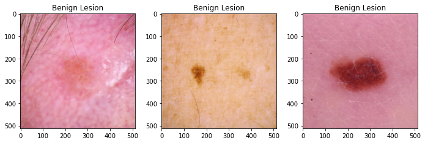

# Skin Cancer Image Classification


## Project Overview
According to [American Academy of Dermatology](https://www.aad.org/media/stats-skin-cancer), skin cancer is the most commonly diagnosed cancer in the United States. Almost 9,500 people in US are diagnosed with skin cancer everyday, and it is estimated that 25% of the Americans will develop skin cancer in their lifetime. The vast mojority of the skin cancer deaths are from melanoma.  However, if the melanoma is detected and treated early, before it spreads to lymph nodes, 5-years survival rate is as high as 99%. This indicates the importance of early diagnosis of melanoma for skin cancer patients. 

On the other hand, the number of unnecessary biopsies for melanoma detection varies between 83% to 96% according to [Assessment of Raman Spectroscopy for Reducing Unnecessary Biopsies for Melanoma Screening](https://www.ncbi.nlm.nih.gov/pmc/articles/PMC7355922/) article. These unnecessary biopsies challenges both patients and healthcare system financially. It is important to improve the accuracy of melanoma diagnosis to reduce this financial burden.     

The aim of this project is to use Convolutional Neural Network (CNN) to distinguish dermoscopic images of malignant skin lesions from benign lesions. In this project **12,436** dermoscopic images are gathered from from [ISIC archive](https://www.isic-archive.com/#!/topWithHeader/onlyHeaderTop/gallery?filter=%5B%5D). I have 8953 images with 4845 benign and 4108 malignant classes for training purpose, 2239 images with 1211 benign and 1028 malignant classes for validation purpose, and also I set aside test/holdout set for final evaluation which has 1244 images with 694 benign and 550 malignant classes.


## Data Overview

The data comes from the International Skin Imaging Collaboration (ISIC) archive. The archive serves as an open resource for public for teaching and research purposes. ISIC hosts challenges in order to facilitate the application of digital skin imaging to help reduce the melonoma mortality. In this project, I will use [ISIC 2020 challenge](https://challenge2020.isic-archive.com/) dataset, [ISIC 2019 challenge](https://challenge2019.isic-archive.com/) dataset, and additional new never seen before malignant images from [ISIC archive](https://www.isic-archive.com/#!/topWithHeader/onlyHeaderTop/gallery?filter=%5B%5D) to classify benign vs. malignant images. Each dataset contains dermoscopic images of unique benign and malignant skin lesions along with metadata info of patient's age, sex, and anatomic location of the lesion.





## Methodology
ImageDataGenerator is used to normalize RGB values of each image and all images will be resized into 64x64 image size as a preprocessing step. In the modeling part, I started baseline with multi-layer perceptron, and then trained various CNNs by trying to hypertune the model to get best accuracy and recall score. The CNN modeling iterations are showed explicitly in the [Image_Processing_and_Modeling](https://github.com/emykes/SkinCancerImageClassification/blob/main/Notebooks/Image_Processing_and_Modeling.ipynb) notebook. In order to implement CNN models to skin lesions dataset, Flatiron school's [CNN codealong notebook](https://github.com/learn-co-curriculum/dsc-convolutional-neural-networks-codealong) is used as a reference.

Also I used pre-trained VGG16 model and did two iteration by building different dense layers after the pre-trained VGG16 model layers to increase accuracy and recall scores. Pre-trained modeling iterations are done in [Transfer_Learning_Models](https://github.com/emykes/SkinCancerImageClassification/blob/main/Notebooks/Transfer_Learning_Models.ipynb) notebook in detail.  

In the compiling part of the all modeling done in this project, I decided to use 'sgd' optimizer. The reason behind this choise is that one recent research article, named [Train faster, generalize better: Stability of stochastic gradient descent](http://proceedings.mlr.press/v48/hardt16.pdf), showed that SGD (Stochastic Gradient Descent) optimizer generalizes better than Adam optimizer, i.e. has less generalization (out-of-sample) error. Since the goal of this project to predict skin lesions classes accurately for previously unseen data, SGD optimizer are used in all the model iterations throughout this project. 


## Results

When we look at the results of the CNN evaluation and VGG16 evaluation scores, it is seen that CNN model has better accuracy and recall score compared to pre-trained VGG16 model. Therefore the final model is chosen to be  **final_CNN_model**  with 91% accuracy and 90% recall scores.


## Conclusions

The final model has 91% accuracy and 90% recall scores. I recommend that this final model can be used as a decision support tool by dermatologists and/or medical professionals as a part of their clinical diagnosis. I would like to insert metadata information along with desmoscopic images into the CNN modeling in order to increase overall scores of the model, since according to one recent research called [Deep Learning Classifier with Patient’s Metadata of Dermoscopic Images in Malignant Melanoma Detection](https://www.dovepress.com/deep-learning-classifier-with-patientrsquos-metadata-of-dermoscopic-im-peer-reviewed-fulltext-article-JMDH) CNN model which includes both image and metadata can increase the accuracy of classification in malignant melanoma detection even with limited data. 

I also would like to remove any sticker, ruler, or hair from the dermoscopic images so that model only focusses on the lesions not any other possible disturbances.


## Information

Check out the [main notebook](https://github.com/emykes/SkinCancerImageClassification/blob/main/Project_Main_Notebook.ipynb) for a detailed discussion of this project, as well as the [presentation](https://github.com/emykes/SkinCancerImageClassification/blob/main/Presentation.pdf). All the Python codes are run on a local computer with the environment info given in the [Environment](https://github.com/emykes/SkinCancerImageClassification/tree/main/Environment) folder.

## Repository Structure

```

├──Environment                              <- folder containing environment requirements info for reproducibility
│   ├── environment.yml
│   └── requirements.txt
│
├── Images                                  <- folder containing saved images for Main Notebook and README
├── Notebooks                               <- folder containing notebooks for each section of the project
│   ├── Data_Exploration.ipynb
│   ├── Image_Processing_and_Modeling.ipynb
│   └── Transfer_Learning_Models.ipynb
│
├── Saved_Models                            <- folder contaning trained model files and results 
├── .gitignore                              <- file specifying files/directories to ignore
├── Project_Main_Notebook.ipynb             <- main notebook of the project
├── README.md                               <- README file
└── Presentation.pdf                        <- presentation slides

``` 
